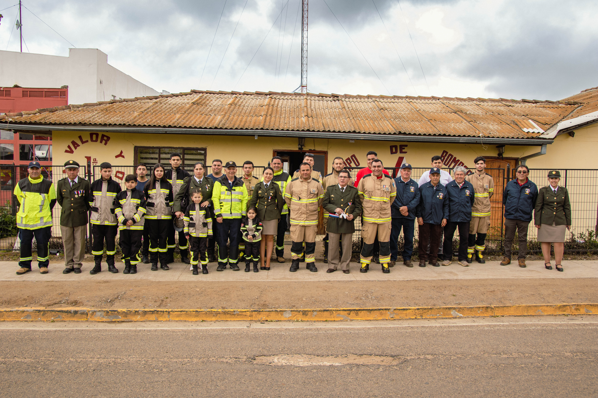
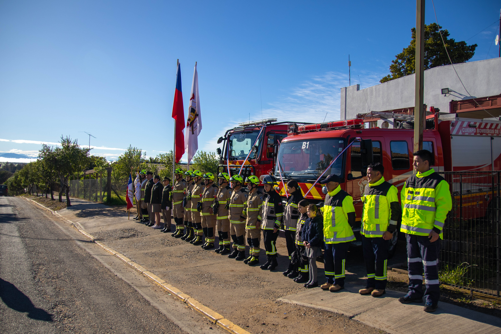

<!DOCTYPE html>
<html lang="es">
<head>
    <meta charset="UTF-8">
    <meta name="viewport" content="width=device-width, initial-scale=1.0">
    <title>Cuerpo de Bomberos La Estrella | Sitio Oficial</title>
    <!-- Iconos y Tipografía -->
    <link rel="stylesheet" href="https://cdnjs.cloudflare.com/ajax/libs/font-awesome/6.0.0/css/all.min.css">
    <link href="https://fonts.googleapis.com/css2?family=Montserrat:wght@400;700;800&family=Open+Sans:wght@400;600&display=swap" rel="stylesheet">
    
</head>
<body>

    

        CENTRAL DE ALARMAS: 132
    

    <header id="inicio">
        

            
        

        <h1>Cuerpo de Bomberos La Estrella</h1>
        
FUNDADO EL 12 DE FEBRERO DE 1972

    </header>

    <nav>
        <a href="#inicio">Inicio</a>
        <a href="#noticia">Nuevo Cuartel</a>
        <a href="#galeria">Institución</a>
        <a href="#contacto">Contacto</a>
    </nav>

    <section class="noticia-principal" id="noticia">
        

            

            

                
Hito Institucional

                <h2>Inauguración del Nuevo Cuartel</h2>
                
Junto al Gobierno Regional, hemos inaugurado nuestra nueva casa. Un cuartel moderno y funcional diseñado para entregar la mejor respuesta a las emergencias de nuestra comuna.

                
Esta obra representa un salto en calidad para la seguridad de todos nuestros vecinos de La Estrella.

            

        

    </section>

    <section class="galeria" id="galeria">
        <h2 style="text-transform: uppercase;">Nuestra Compañía</h2>
        
Orgullo, Disciplina y Compromiso Social

        

            

                
            

            

                
            

        

    </section>

    <footer>
        

            

                <h3 class="footer-title">Contacto</h3>
                
<i class="fas fa-map-marker-alt"></i> Manuel Rodríguez 878, La Estrella.

                
<i class="fas fa-envelope"></i> laestrella@bomberos.cl

                
<i class="fab fa-instagram"></i> @cblaestrella

            

            

                <h3 class="footer-title">Institución</h3>
                
Primera Compañía

                
Cuerpo de Bomberos La Estrella

                
Región de O'Higgins, Chile.

            

            

                <h3 class="footer-title">Emergencia</h3>
                
132

                
Llamada gratuita desde cualquier teléfono.

            

        

        

            &copy; 2026 Cuerpo de Bomberos La Estrella. Todos los derechos reservados.
        

    </footer>

</body>
</html>
